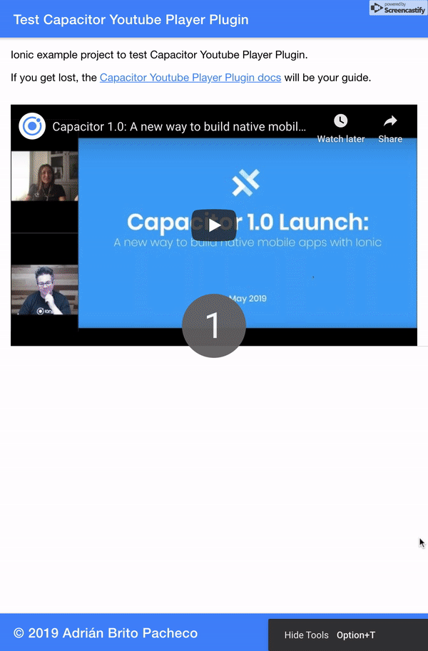
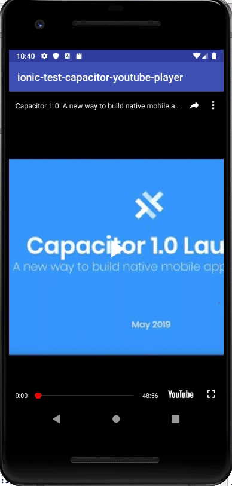

# Ionic-Test-Capacitor-Youtube-Player

Sample Ionic project to test Capacitor Youtube Player Plugin.

#### App WEB example



#### App iOS example


#### App Android example




## Running

Before you go through this example, you should have at least a basic understanding of Ionic concepts. You must also already have Ionic installed on your machine.

* Test in localhost:

To run it, cd into `ionic-test-capacitor-youtube-player` and run:

```bash
npm install
ionic serve
```

## Install Capacitor Youtube Player Plugin

``` bash
    npm install --save capacitor-youtube-player@latest
```

## Using Capacitor Youtube Player Plugin

IMPORTANT NOTE iOS:

Currently there is a small error when you testing the plugin in iOS. The following line of code needs to be modified in xcode:

YouTubePlayer.swift:339:102: 'UIWebViewNavigationType' has been renamed to 'UIWebView.NavigationType'


### Ionic / Angular project

1) Install the plugin.

```bash
npm install --save capacitor-youtube-player@latest
```

2) Import plugin in your page.

```bash
import { Component, OnInit, AfterViewInit } from '@angular/core';

import { YoutubePlayerWeb } from 'capacitor-youtube-player'; // Web version

import { Plugins, Capacitor } from '@capacitor/core'; // Native version

@Component({
  selector: 'app-home',
  templateUrl: 'home.page.html',
  styleUrls: ['home.page.scss'],
})
export class HomePage implements OnInit, AfterViewInit {

  currentYear = new Date().getFullYear();

  constructor() {
  }

  ngOnInit() {
  }

  ngAfterViewInit() {
    if (Capacitor.platform === 'web') {
      this.initializeYoutubePlayerPluginWeb();
    } else { // Native
      this.initializeYoutubePlayerPluginNative();
    }
  }

  async initializeYoutubePlayerPluginWeb() {
    const options = {playerId: 'youtube-player', playerSize: {width: 640, height: 360}, videoId: 'tDW2C6rcH6M'};
    const result = await YoutubePlayerWeb.initialize(options);
    console.log('playerReady', result);
  }

  async destroyYoutubePlayerPluginWeb() {
    const result = await YoutubePlayerWeb.destroy('youtube-player');
    console.log('destroyYoutubePlayer', result);
  }

  async initializeYoutubePlayerPluginNative() {

    const { YoutubePlayer } = Plugins;

    const options = {width: 640, height: 360, videoId: 'tDW2C6rcH6M'};
    const playerReady = await YoutubePlayer.initialize(options);
  }

}
```

3) Build your app.

You must build your Ionic / Angular project at least once before adding any native platforms.

```bash
    ionic build // Ionic
    ng build // Angular
```

4) Add Platforms.

```bash
    npx cap add ios
    npx cap add android
```

5) Open IDE to build, run, and deploy.

```bash
    npx cap open ios
    npx cap open android
```

## Requirements

* [Node.js](http://nodejs.org/)
* [Ionic](https://ionicframework.com/getting-started#cli)
